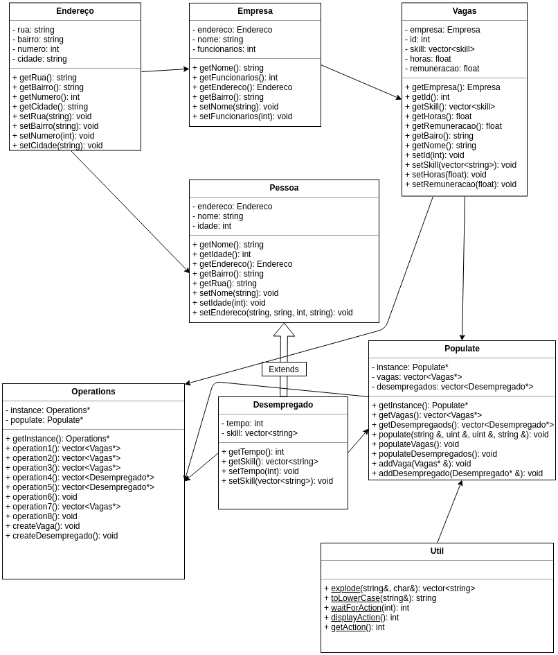

# Relatório Trabalho Prático - Programação Orientada à Objetos

***Aluno***: *Camilo Esteves Mendes de Avelar*

## Funcionamento do programa

Ao executar o programa, a seguinte tela é exibida

```
Digite 0 para sair do programa.
Digite 1 para dado o nome de um desempregado, exibir todas as vagas localizadas no mesmo bairro do desempregado
Digite 2 para dado o nome de um desempregado, exibir todas as vagas em que o desempregado supri os requisitos de skill.
Digite 3 para dado um skill, exibir todas as vagas que requer o dado skill
Digite 4 para dado o id de uma vaga, exibir todos os desempregados que moram no mesmo bairro,
Digite 5 para dado o id de uma vaga, exibir todos os desempregados que possuem os skills requeridos pela vaga.
Digite 6 para dado um skill, exibir todas as vagas e os desempregados que possuem o dado skill.
Digite 7 para dado o nome de uma empresa, exibir todas as vagas referentes a empresa
Digite 8 para atribuir vagas à Desempregados
Digite 9 para adicionar um Desempregado
Digite 10 para adicionar uma Vaga
--------------------------------------
(digite o numero):
```
Ao digitar uma opção, é retornado o resultado e espera o usuário apertar Enter, ao apertar a tecla, retorna para a tela inicial até o usuário digitar 0.

## Diagrama UML



## Classes auxiliares

### Populate

Classe cuja responsabilidade é ler os arquivos de entradas e popular os vetores com as respectivas classes (Vagas e Desempregados), esta função é responsável por popular os vetores:

```c++
void Populate::populate(const string &path, const uint &qtdParams, const uint &skillsLocation, const string &action) {
  ifstream input(path);
  uint auxCount = 0;
  vector<string> params (qtdParams);
  vector<string> skills;

  if(input) {
    for( string line; getline(input, line); ) {

      if( auxCount < qtdParams) {
        if (auxCount == skillsLocation - 1) {
          skills = Util::explode(line, ' ');
          sort(skills.begin(), skills.end());
          string lastSkill;
          int indexSkill = 0;
          for(string skill : skills) { // NÃO PERMITE INCLUSÃO DE SKILLS IGUAIS
            if(lastSkill == skill) {
              skills.erase(skills.begin() + indexSkill);
            }
            lastSkill = skill;
            indexSkill++;
          }
        } else {
          params[auxCount] = line;
        }

        if ( auxCount == qtdParams - 1 ) {
          for ( uint i = 0; i < params.size(); i++ ) {
            if( i == qtdParams - 1 ) {
              if (action == "desempregados") {
                desempregados.push_back(new Desempregado(params[0], stoi(params[1]), skills, stoi(params[3]))); 
              } else if (action == "vagas") {
                vagas.push_back(new Vagas(stoi(params[0]), skills, stof(params[2]),stof(params[3]), params[4], stoi(params[5]), params[6], params[7], stoi(params[8]), params[9]));

                desempregados[stoi(params[0]) - 1]->setEndereco(params[6], params[7], stoi(params[8]), params[9]); // POPULA ALGUNS ENDERECOS EM DESEMPREGADOS
              }
            }
          }

          auxCount = 0;
        } else {
          auxCount++;
        }
      }
    }
  } else {
    cerr << "File could not be opened!\n"; // Report error
    cerr << "Error code: " << strerror(errno) << endl;
  }
}
```

Ela lê linha por linha os arquivos entradaDes.txt e entradaVagas.txt, cada arquivo tem suas peculiaridades, número diferentes de linhas e cada linha é uma propriedade para criar o objeto das classes, ela recebe a quantidade de parâmetros para ler as linhas e em qual linha estão os skills. A cada iteração de linha um contador é aumentado, caso chegue no número final de parâmetros, ele cria o objeto e reseta o contador, garantindo que o parâmetro certo seja incluido no objeto.
  
  Ela ainda é uma classe *Singleton*, ou seja, só pode existir uma instancia, garantindo que exista apenas um vetor de vagas e desempregados na execução.
  
  Também é a única responsável por adicionar novas classes ao vetor, por segurança.
  
  ## Util
  
É a classe com funções staticas auxiliares que podem ser usadas em diversos lugares do programa, funções como:
    
```c++
static const vector<string> explode(const string&, const char&);
static const string toLowerCase(const string&);
static const int waitForAction(const int);
static const int displayAction();
static const int getAction();
```

A função explode é responsável por separar uma string em um vector de strings, recebe como parâmetros a string para separar e a string que delimitará a separação. Ex: ',' <- separará por virgula.

A função toLowerCase recebe uma string e retorna um string em caixa baixa, para comparação.

A função waitForAction recebe um int, serve para auxiliar a exibição do programa.

A função displayAction auxilia a exibição do programa.

A função getAction auxilia a exibição do programa.

## Operations

```c++
const vector<Vagas*> operation1();
const vector<Vagas*> operation3();
const vector<Vagas*> operation2();
const vector<Desempregado*> operation4();
const vector<Desempregado*> operation5();
const void operation6();
const vector<Vagas*> operation7();
const void createVaga();
const void createDesempregado();
const void operation8();
```

É a classe responsável pelas operações pedidas no trabalho, é nela que está a implementação das operações.

Também é uma classe *Singleton*, garantindo apenas uma instância por execução.

### operation1
```c++
  vector<Vagas*> result;
  string inNome;

  getline(cin, inNome);
  
  for(Desempregado *desempregado : populate->getDesempregados()) {
    if(Util::toLowerCase(desempregado->getNome()) == Util::toLowerCase(inNome)) {
      for(Vagas *vaga : populate->getVagas()) {
        if(Util::toLowerCase(vaga->getBairro()) == Util::toLowerCase(desempregado->getBairro())) {
          result.push_back(vaga);
        }
      }
    }
  }
  
for (Vagas* vaga : result) {
 cout << vaga->getId() << endl;
}
```
Realiza um loop pelo vetor de desempregados, se o nome do desempregado for igual ao nome digitado, ele realiza um outro loop pelo vetor de vagas, comparando o bairro do desempregado com o bairro da vaga, se for igual ele adiciona a vaga em um vetor de resultados, que depois é percorrido listando os ids das vagas.

### operation2
```c++
vector<Vagas*> result;
string nomeDesempregado;
getline(cin, nomeDesempregado);
for(Desempregado *desempregado : populate->getDesempregados()) {
  if(Util::toLowerCase(desempregado->getNome()) == Util::toLowerCase(nomeDesempregado)) {
    vector<string> skillDesempregado = desempregado->getSkill();
    uint sizeDesemp = skillDesempregado.size();
    bool result;
    for(Vagas *vaga : populate->getVagas()) {
      vector<string> skillVaga = vaga->getSkill();
      uint sizeVaga = skillVaga.size();
      sort(skillVaga.begin(), skillVaga.end());
      sort(skillDesempregado.begin(), skillDesempregado.end());
      uint auxSearch = 0;
      if(sizeVaga <= sizeDesemp) {
        for(string skill : skillDesempregado) {
          result = binary_search(skillVaga.begin(), skillVaga.end(), skill);
          if(result) {
            auxSearch++;
          }
        }
        if(auxSearch == sizeVaga) {
          cout << vaga->getId() << endl;
         }
      }
    }
  }
}
```
Percorre o vetor de desempregados até encontrar um com o nome digitado, se encontrar, recupera o vetor de skill do desempregado, depois percorre o vetor de vagas também recuperando o vetor de skill da vaga, ordena os vetores de skill e realiza uma verificação, se o tamanho do vetor de vagas do desempregado for maior ou igual ao tamanho do vetor de vaga(significa que o empregado possa ter todas as skills necessitadas pela vaga), ele realiza uma busca, percorrendo o vetor de skill do desempregado, se a skill do desempregado estiver no vetor no skill da vaga, ele aumenta o contador, caso contratio nao implementa, ao final, se o contador for igual ao tamanho de vagas, significa que o empregado tem todos os requisitos da vaga.

### operation3

```c++
vector<Vagas*> result;
string skillName;

getline(cin, skillName);
for(Vagas *vaga : populate->getVagas()) {
  for(string skillVaga : vaga->getSkill()) {
    if(skillVaga == skillName) {
      result.push_back(vaga);
    }
  }
}

for (Vagas* vaga : result) {
 cout << vaga->getId() << endl;
}
```
Percorre o vetor de vagas, e depois o vetor de skill da vaga, se o skill da vaga for igual ao skill digitado, ele adiciona a vaga ao vetor de resultado, depois percorre esse vetor de resultado retornando o id da vaga.

### operation4

```c++
vector<Desempregado*> result;
int idVaga;
cin >> idVaga;
 
for(Vagas *vaga : populate->getVagas()) {
  if(vaga->getId() == idVaga){
    for(Desempregado *desempregado : populate->getDesempregados()) {
      if(Util::toLowerCase(vaga->getBairro()) == Util::toLowerCase(desempregado->getBairro())){
        result.push_back(desempregado);
      }
    }
  }
}

for (Desempregado* desempregado : result) {
  cout << desempregado->getNome() << endl;
}
```
Percorre o vetor de vagas, se o id da vaga for igual ao id digitado, ele percorre o vetor de desempregados, se o bairro da vaga for igual ao bairro do desempregado, ele adiciona o resultado ao vetor de resultados, depois percorre esse vetor de resultados exibindo o nome do desempregado.

### operation5

```c++
vector<Desempregado*> result;
int idVaga;

cin >> idVaga;
for(Vagas *vaga : populate->getVagas()) {
  if(vaga->getId() == idVaga){
    for(Desempregado *desempregado : populate->getDesempregados()) {
      if (vaga->getSkill() == desempregado->getSkill()) {
        result.push_back(desempregado);
      }
    } 
  }
}

for (Desempregado* desempregado : result) {
  cout << desempregado->getNome() << endl;
}
```
Percorre o vetor de vagas, caso o id da vaga for igual ao id digitado, percorre o vetor de desempregados, caso o vetor de skills da vaga for igual ao vetor de skills do desempregado, adiciona ao vetor de resultado, que depois é percorrido retornando o nome do desempregado.

### operation6

```c++
  vector<Vagas*> resultVagas;
  vector<Desempregado*> resultDesempregados;
  string skillName1;

  getline(cin, skillName1);

  for(Vagas *vaga : populate->getVagas()) {
    for(string skillVaga : vaga->getSkill()) {
      if(skillVaga == skillName1) {
        resultVagas.push_back(vaga);
      }
    }
  }

  for(Desempregado *desempregado : populate->getDesempregados()) {
    for(string skillDesempregado : desempregado->getSkill()) {
      if(skillDesempregado == skillName1) {
        resultDesempregados.push_back(desempregado);
      }
    }
  }
  
for (Desempregado* desempregado : resultDesempregados) {
 cout << desempregado->getNome() << endl;
}
for (Vagas* vaga : resultVagas) {
 cout << vaga->getId() << endl;
}
```
Percorre o vetor de vagas, e o vetor de skill da vaga, caso o skill for igual ao skill digitado, adiciona o resultado ao vetor de resultados de vagas, faz o mesmo com os desempregados.

Depois percorre os vetores de resultados imprimindo o nome dos desempregados e o id das vagas.

### operation7

```c++
vector<Vagas*> result;
string nomeEmpresa;

getline(cin, nomeEmpresa);
for(Vagas *vaga : populate->getVagas()) {
  if(Util::toLowerCase(vaga->getNome()) == Util::toLowerCase(nomeEmpresa)) {
    result.push_back(vaga);
  }
}

for (Vagas* vaga : result) {
 cout << vaga->getId() << endl;
}
```

Percorre o vetor de vagas, caso o nome da empresa da vaga for igual ao nome digitado, adiciona a vaga ao vetor de resultados, que depois é percorrido exibindo o id das vagas.

### operation8

```c++
vector<Desempregado*> desempregados = populate->getDesempregados();
bool result;
cout << setw(23) << "Nome do desempregado" << setw(5) << " Id da vaga" << endl;
for(Vagas *vaga : populate->getVagas()) {
  vector<string> skillVaga = vaga->getSkill();
  uint sizeVaga = vaga->getSkill().size();
  uint index = 0;
  for(Desempregado *desempregado : desempregados) {
    vector<string> skillDesemp = desempregado->getSkill();
    uint sizeDesempregado = desempregado->getSkill().size();
    if(sizeVaga <= sizeDesempregado) {
      sort(skillVaga.begin(), skillVaga.end());
      sort(skillDesemp.begin(), skillDesemp.end());
      uint auxSearch = 0;
      for (string skill : skillDesemp) {
        result = binary_search(skillVaga.begin(), skillVaga.end(), skill);
        if(result) {
          auxSearch++;
        }
      }
      if(auxSearch == sizeVaga) {
        cout << setw(23) << desempregado->getNome() << setw(5) << vaga->getId() << endl;
        desempregados.erase(desempregados.begin() + index);
        break;
      }
    }
    index++;
  } 
}
```
Percorre o vetor de vagas, pegando os skills da vaga, depois percorre o vetor de desempregados, recuperando os skills do desempregado, realiza uma verificação, caso o tamanho do vetor de skill do desempregado for maior que o de vagas (garante que o desempregado possa ter todas as skills requeridas), ele ordena o vetor de skills das vagas e desempregados, depois percorre o vetor de skill de desempregados verificando se o skill está presente no vetor das vagas, caso esteja, aumenta um contador auxiliar, caso contrario, não aumenta.
Ao final de percorrer os vetores, verifica se o tamanho do contador é igual ao tamanho do vetor de skill da vaga, caso for, imprime o nome do desempregado e o id da vaga, depois deleta o desempregado encontrado do vetor de desempregados, para evitar que uma vaga seja atribuida a mais de um desempregado.
